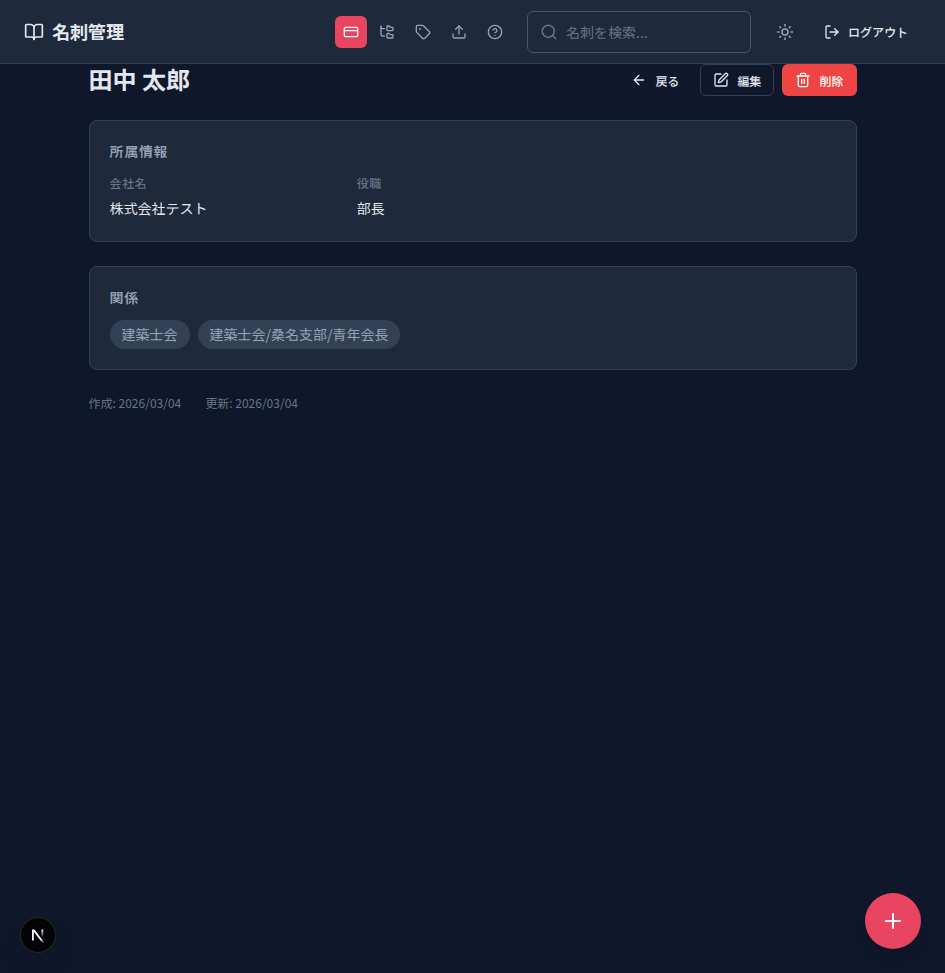
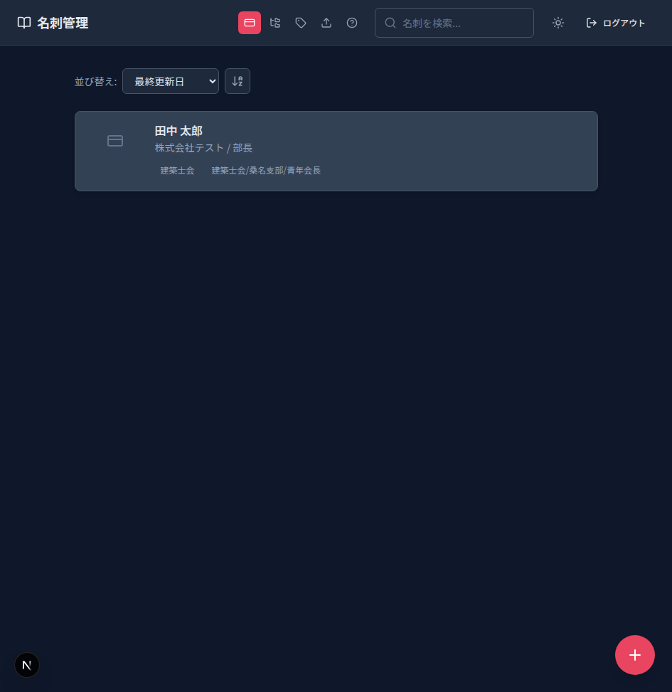
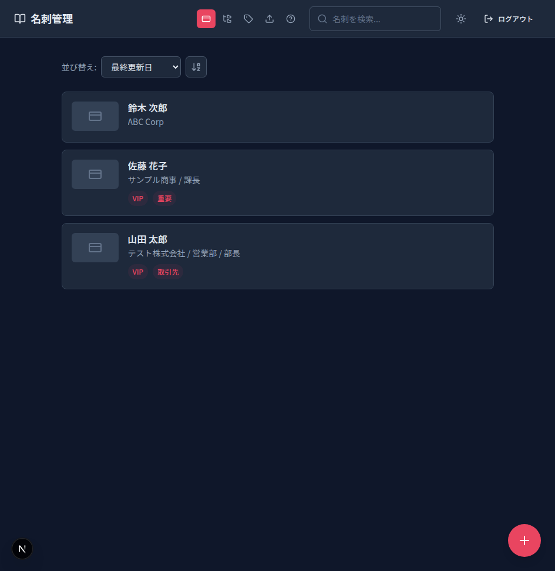
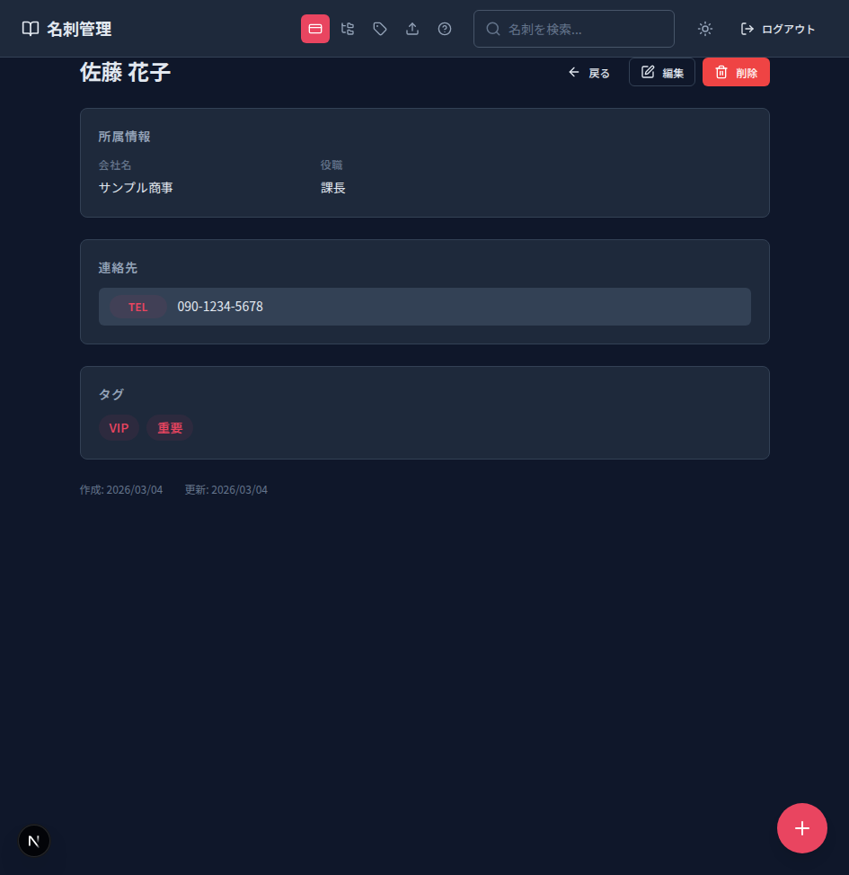
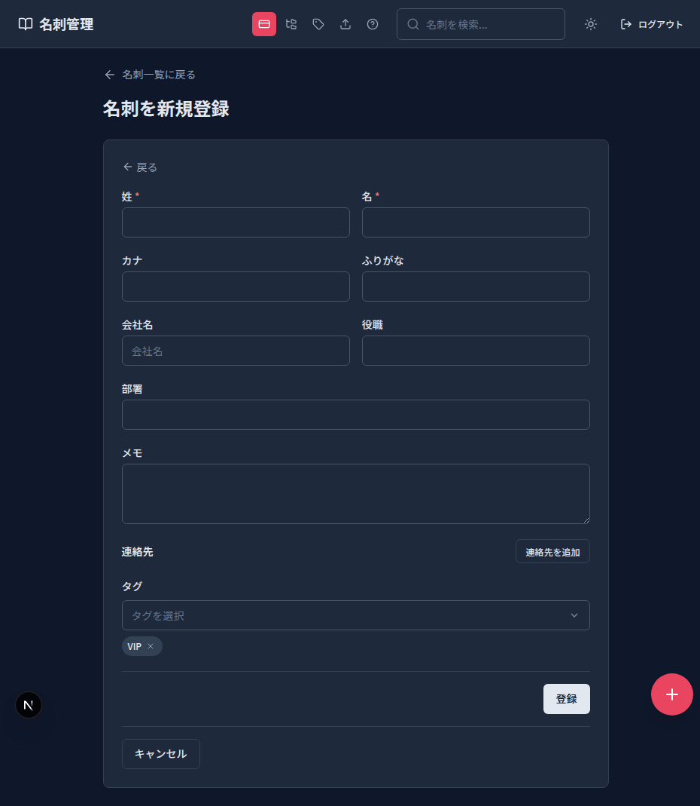

# 名刺詳細ページ 問題調査レポート

## 調査概要

名刺詳細ページ (`/namecards/[id]`) に報告された2つのUI問題を調査した。

1. **詳細ページの上の余白がおかしい** — ヘッダーとコンテンツの間に適切なスペースがない
2. **連絡先がすべて「EMAIL」と表示される** — 連絡先の種類に関わらず、すべてのタイプが `email` になっている

---

## Issue 1: 詳細ページの上部余白の問題

### 現象

詳細ページでは、ヘッダー（sticky, 高さ4rem）の直下からコンテンツが始まり、一覧ページと比較してトップの余白が不足している。

### スクリーンショット

- `docs/screenshot_detail_spacing.png` — カード780（伊藤 健一）の詳細ページ全体
- `docs/screenshot_detail_780.png` — 同カードのビューポートキャプチャ

### 原因

**一覧ページ**と**詳細ページ**のスタイル設定に差異がある。

| ページ | ファイル | クラス | margin/padding |
|--------|----------|--------|----------------|
| 一覧 | `frontend/src/app/(main)/namecards/namecards.module.scss` (L1-8) | `.page` | `margin: $space-8 auto; padding: 0 $space-4;` |
| 詳細 | `frontend/src/components/namecard/NameCardDetail.module.scss` (L3-9) | `.detail` | `margin: 0 auto;` (**トップ余白なし**) |

詳細ページの `.detail` クラスにはトップ方向の `margin` も `padding` も設定されていない。

**関連ファイル:**

| ファイル | 行 | 内容 |
|----------|-----|------|
| `frontend/src/components/namecard/NameCardDetail.module.scss` | L3-9 | `.detail` — `margin: 0 auto` のみ、トップ余白なし |
| `frontend/src/app/(main)/namecards/namecards.module.scss` | L1-8 | `.page` — `margin: $space-8 auto` でトップ余白あり（比較用） |
| `frontend/src/app/(main)/namecards/[id]/page.tsx` | — | `<NameCardDetail>` を直接レンダリング、ラッパーdivなし |
| `frontend/src/app/(main)/layout.tsx` | — | `<main>{children}</main>` — paddingなし |
| `frontend/src/components/layout/header.module.scss` | — | ヘッダーは `position: sticky; top: 0; height: 4rem` |

### 修正案

`NameCardDetail.module.scss` の `.detail` クラスに、一覧ページと同等のトップ余白を追加する:

```scss
// 修正前 (L3-9)
.detail {
  display: flex;
  flex-direction: column;
  gap: $space-6;
  max-width: 48rem;
  margin: 0 auto;
}

// 修正後
.detail {
  display: flex;
  flex-direction: column;
  gap: $space-6;
  max-width: 48rem;
  margin: $space-8 auto;   // 一覧ページと統一
  padding: 0 $space-4;     // 左右paddingも一覧ページと統一
}
```

---

## Issue 2: 連絡先がすべて「EMAIL」と表示される

### 現象

連絡先の種類（電話、住所、Webサイト、SNS等）に関わらず、すべて `type = 'email'` として表示・保存されている。

### DB証拠

```sql
SELECT id, type, value FROM contact_methods WHERE name_card_id IN (774, 775);
```

| id  | type  | value                           |
|-----|-------|---------------------------------|
| 572 | email | 三重県桑名市大字上野２１９番地３ |
| 573 | email | 0594211497                      |
| 574 | email | nozyjp.1214@gmail.com           |
| 575 | email | 07092026027                     |
| 576 | email | nozyjp.com                      |
| 577 | email | https://x.com/NOZY_jp           |
| 578 | email | https://github.com/NOZY-jp      |

住所・電話番号・WebサイトURL・SNSリンクなど、すべてのレコードが `type = 'email'` で保存されている。

### Playwright確認

現在ログイン中のユーザー（user_id=1121）が所有するカード（ID: 776-780）には連絡先データが0件のため、UIでの「EMAIL」表示を直接スクリーンショットで確認できなかった。連絡先を持つカード（ID: 774-775, user_id=1119）は別ユーザー所有のため、API が 404 を返しアクセス不可。

上記のDB証拠により、問題はUI表示ロジックではなく、**保存時のデータ不正**であることが確定している。

### 原因

**根本原因**: `NameCardForm.tsx` のフォーム内、連絡先タイプ選択の `Select` コンポーネントが react-hook-form の状態を正しく更新できていない。

**詳細:**

1. **フォームのデフォルト値** (`NameCardForm.tsx` L183):
   ```tsx
   append({ type: "email", value: "", is_primary: false })
   ```
   新規連絡先追加時に `type: "email"` がデフォルトとして設定される。

2. **Select の `onValueChange` ハンドラ** (`NameCardForm.tsx` L199-211):
   ```tsx
   onValueChange={(val) => {
     const input = document.querySelector(
       `input[name="contact_methods.${index}.type"]`,
     ) as HTMLInputElement | null;
     if (input) {
       const nativeInputValueSetter =
         Object.getOwnPropertyDescriptor(
           window.HTMLInputElement.prototype,
           "value",
         )?.set;
       nativeInputValueSetter?.call(input, val);
       input.dispatchEvent(new Event("input", { bubbles: true }));
     }
   }}
   ```
   このハンドラは DOM 操作（`nativeInputValueSetter` + イベントディスパッチ）で hidden input の値を変更しようとしているが、react-hook-form の `register` で管理されているフィールドの内部状態を正しく更新できていない。結果として、フォーム送信時に初期値の `"email"` がそのまま送信される。

3. **Select の `value` プロパティ** (`NameCardForm.tsx` L198):
   ```tsx
   value={field.type}
   ```
   `useFieldArray` の `field` オブジェクトから取得した値を使っているが、これは初期レンダリング時のスナップショットであり、ユーザーが Select で別のタイプを選択しても、react-hook-form 側の値が更新されないため、リレンダリング後も `"email"` のままになる可能性がある。

### 副次的問題: フロントエンド/バックエンド enum の不一致

| フロントエンド (`contact-method.ts`) | バックエンド (`schemas/__init__.py`) |
|--------------------------------------|--------------------------------------|
| x                                    | twitter                              |
| youtube                              | wechat                               |
| discord                              | whatsapp                             |
| booth                                | telegram                             |
| github                               | skype                                |
| tiktok                               | zoom                                 |
| address                              | teams                                |

フロントエンドにあってバックエンドにない型、またはその逆が存在する。バックエンドの `ContactMethodType` はバリデーションに使用されるため、フロントエンドから `x`, `youtube`, `discord`, `booth`, `github`, `tiktok`, `address` を送信するとバリデーションエラーになる可能性がある。

**関連ファイル:**

| ファイル | 行 | 内容 |
|----------|-----|------|
| `frontend/src/components/namecard/NameCardForm.tsx` | L196-228 | Select コンポーネントと hidden input のバグ |
| `frontend/src/components/namecard/NameCardForm.tsx` | L183 | `append()` のデフォルト値 `type: "email"` |
| `frontend/src/lib/schemas/contact-method.ts` | L3-21 | フロントエンド `CONTACT_METHOD_TYPES` |
| `backend/app/schemas/__init__.py` | L55-74 | バックエンド `ContactMethodType` enum |
| `frontend/src/components/namecard/NameCardDetail.tsx` | L123 | 表示は `{cm.type}` で正しい（問題はデータ側） |

### 修正案

#### (a) フォームのタイプ選択バグ修正 (`NameCardForm.tsx`)

DOM操作によるハックを廃止し、react-hook-form の `setValue` を使って直接フォーム状態を更新する:

```tsx
// 修正前 (L196-228)
<Select
  value={field.type}
  onValueChange={(val) => {
    const input = document.querySelector(
      `input[name="contact_methods.${index}.type"]`,
    ) as HTMLInputElement | null;
    if (input) {
      const nativeInputValueSetter =
        Object.getOwnPropertyDescriptor(
          window.HTMLInputElement.prototype,
          "value",
        )?.set;
      nativeInputValueSetter?.call(input, val);
      input.dispatchEvent(new Event("input", { bubbles: true }));
    }
  }}
>
  ...
</Select>
<input
  type="hidden"
  {...register(`contact_methods.${index}.type`)}
/>

// 修正後
<Select
  value={watch(`contact_methods.${index}.type`)}
  onValueChange={(val) => {
    setValue(`contact_methods.${index}.type`, val, {
      shouldValidate: true,
      shouldDirty: true,
    });
  }}
>
  ...
</Select>
{/* hidden input 不要 — setValue で直接更新するため削除 */}
```

`useForm` から `watch` と `setValue` を取得する必要がある:
```tsx
const { register, handleSubmit, setValue, watch, ... } = useForm({ ... });
```

#### (b) フロントエンド/バックエンド enum の統一

両方の enum を統一し、すべての連絡先タイプを網羅する。どちらに合わせるかはプロジェクトの方針次第だが、以下を推奨:

- バックエンドに `x`, `youtube`, `discord`, `booth`, `github`, `tiktok`, `address` を追加
- フロントエンドに `twitter` を `x` に統一（または両方サポート）
- `wechat`, `whatsapp`, `telegram`, `skype`, `zoom`, `teams` をフロントエンドにも追加（必要に応じて）

#### (c) 既存データの修復

DB内の不正データは、連絡先の `value` の内容から正しい `type` を推定して修正するマイグレーションスクリプトが必要:

```sql
-- 例: 電話番号パターンの修正
UPDATE contact_methods SET type = 'tel'
WHERE type = 'email' AND value ~ '^[0-9\-]+$' AND length(value) >= 10;

-- 例: URL パターンの修正
UPDATE contact_methods SET type = 'website'
WHERE type = 'email' AND value ~ '^https?://';

-- 例: 住所パターンの修正（日本語文字を含む場合）
UPDATE contact_methods SET type = 'address'
WHERE type = 'email' AND value ~ '[都道府県市区町村]';
```

---

## まとめ

| 問題 | 原因 | 深刻度 | 修正対象ファイル |
|------|------|--------|------------------|
| 上部余白 | `.detail` にトップ余白未設定 | 低 | `NameCardDetail.module.scss` L3-9 |
| 連絡先タイプ | Select の onValueChange が react-hook-form を更新できていない | 高 | `NameCardForm.tsx` L196-228 |
| enum 不一致 | フロントエンド/バックエンドで異なるタイプ定義 | 中 | `contact-method.ts`, `schemas/__init__.py` |
| 既存データ | DB に不正な `type='email'` データ蓄積 | 高 | DBマイグレーション必要 |

---

## Issue 3: 作成画面と編集画面の入力フィールド差異

### 調査日

2026-03-04

### 現象

名刺の手入力**作成画面** (`/namecards/new`) と**編集画面** (`/namecards/[id]` の編集ダイアログ) で入力できるフィールドに差がある。特に、**編集画面では連絡先・所属・タグが編集できない**。

### スクリーンショット

- `docs/screenshot_create_form.png` — 作成画面（手入力モード）のフルページ
- `docs/screenshot_edit_dialog.png` — 編集ダイアログ（カード780: 伊藤 健一）

### フィールド比較一覧

| フィールド | 作成画面 (`NameCardForm.tsx`) | 編集画面 (`NameCardEditDialog.tsx`) | 差異 |
|-----------|:---:|:---:|------|
| 姓 (last_name) | ✅ | ✅ | — |
| 名 (first_name) | ✅ | ✅ | — |
| カナ (last_name_kana) | ✅ | ✅ | — |
| ふりがな (first_name_kana) | ✅ | ✅ | — |
| 会社名 (company_name) | ✅ | ✅ | — |
| 役職 (position) | ✅ | ✅ | — |
| 部署 (department) | ✅ | ✅ | — |
| メモ (memo) | ✅ | ✅ | — |
| **連絡先 (contact_methods)** | ✅ 動的追加/削除 | ❌ **なし** | **重大な差異** |
| **所属・関係 (relationship_ids)** | ✅ Select + チップ | ❌ **なし** | **差異あり** |
| **タグ (tag_ids)** | ✅ Select + チップ | ❌ **なし** | **差異あり** |

### Playwright による UI 確認結果

#### 作成画面のスナップショット（手入力モード選択後）

```
textbox "姓 *"
textbox "名 *"
textbox "カナ"
textbox "ふりがな"
textbox "会社名"
textbox "役職"
textbox "部署"
textbox "メモ"
[連絡先セクション]
  ラベル "連絡先"
  button "連絡先を追加"      ← 動的に連絡先行を追加可能
[所属・関係セクション]        ← relationships が渡された場合に表示
[タグセクション]              ← tags が渡された場合に表示
button "登録"
```

#### 編集画面のスナップショット（編集ダイアログ）

```
heading "名刺を編集"
textbox "姓 *": 伊藤
textbox "名 *": 健一
textbox "カナ": イトウ
textbox "ふりがな": ケンイチ
textbox "会社名"
textbox "役職": 係長
textbox "部署": 経理部
textbox "メモ"
button "キャンセル"
button "保存"
                              ← 連絡先セクション **なし**
                              ← 所属・関係セクション **なし**
                              ← タグセクション **なし**
```

### 原因分析

#### アーキテクチャの問題

作成画面と編集画面は**完全に別のコンポーネント**を使用している。

| | 作成画面 | 編集画面 |
|---|---|---|
| ページ | `app/(main)/namecards/new/page.tsx` | `app/(main)/namecards/[id]/page.tsx` |
| フォーム | `NameCardForm.tsx` (355行) | `NameCardEditDialog.tsx` (134行) |
| UI形式 | インラインフォーム | ダイアログ |
| `useFieldArray` | ✅ 使用（連絡先の動的追加） | ❌ 未使用 |
| relationships/tags データ | ✅ `getRelationships()` / `getTags()` を fetch | ❌ fetch なし |

`NameCardEditDialog.tsx` は `NameCardForm.tsx` を**再利用していない**。独自にフォームを実装しており、以下が欠落している:

1. **連絡先 (`contact_methods`)**: `useFieldArray` による動的フォームが丸ごと存在しない (L175-251 相当)
2. **所属・関係 (`relationship_ids`)**: Select + チップUIが存在しない (L253-298 相当)
3. **タグ (`tag_ids`)**: Select + チップUIが存在しない (L301-347 相当)
4. **データ取得**: `getRelationships()` / `getTags()` の API 呼び出しが `[id]/page.tsx` に存在しない

#### 該当ファイルと行番号

| ファイル | 行 | 説明 |
|----------|-----|------|
| `frontend/src/components/namecard/NameCardForm.tsx` | L66-354 | 作成用フォーム（フル機能） |
| `frontend/src/components/namecard/NameCardForm.tsx` | L100-103 | `useFieldArray` で `contact_methods` を管理 |
| `frontend/src/components/namecard/NameCardForm.tsx` | L175-251 | 連絡先セクション UI |
| `frontend/src/components/namecard/NameCardForm.tsx` | L253-298 | 所属・関係セクション UI |
| `frontend/src/components/namecard/NameCardForm.tsx` | L301-347 | タグセクション UI |
| `frontend/src/components/namecard/NameCardEditDialog.tsx` | L23-133 | 編集ダイアログ（連絡先・関係・タグ **なし**） |
| `frontend/src/components/namecard/NameCardEditDialog.tsx` | L35-44 | `defaultValues` — `contact_methods` フィールドなし |
| `frontend/src/app/(main)/namecards/[id]/page.tsx` | L1-73 | 編集ページ — `getRelationships` / `getTags` の import/fetch なし |
| `frontend/src/app/(main)/namecards/new/page.tsx` | L41-48 | 作成ページ — `getRelationships` / `getTags` を fetch |

### コンポーネント化の可否

**結論: コンポーネント化は可能であり、推奨**

`NameCardForm.tsx` は既に汎用的な props インターフェースを持っており、編集画面でも再利用可能:

```tsx
interface NameCardFormProps {
  defaultValues?: Partial<NamecardCreateFormData & {
    contact_methods: Array<{ type: string; value: string; label?: string }>;
  }>;
  relationships?: RelationshipOption[];
  tags?: TagOption[];
  onSubmit?: (data: NamecardCreateFormData) => void;
  submitLabel?: string;
}
```

`NameCardEditDialog.tsx` を廃止し、`NameCardForm.tsx` をダイアログ内で利用すれば、全フィールドが統一される。

### 修正案

#### 案A: `NameCardEditDialog` で `NameCardForm` を再利用（推奨・工数: Small）

`NameCardEditDialog.tsx` の独自フォームを `NameCardForm` コンポーネントに置き換える。

**修正対象ファイル:**

1. **`frontend/src/app/(main)/namecards/[id]/page.tsx`**
   - `getRelationships()` / `getTags()` を fetch して `NameCardEditDialog` に渡す

2. **`frontend/src/components/namecard/NameCardEditDialog.tsx`**
   - 独自フォームを削除し、`NameCardForm` を Dialog 内に配置
   - 既存の `card` データから `defaultValues` を構成（`contact_methods` を含む）

```tsx
// 修正イメージ: NameCardEditDialog.tsx
import { NameCardForm } from "./NameCardForm";

export function NameCardEditDialog({ card, open, onSave, onClose, relationships, tags }: Props) {
  const defaultValues = {
    first_name: card.first_name,
    last_name: card.last_name,
    // ... 基本フィールド ...
    contact_methods: card.contact_methods?.map(cm => ({
      type: cm.type,
      value: cm.value,
      label: cm.label,
    })) ?? [],
    relationship_ids: card.relationships?.map(r => Number(r.id)) ?? [],
    tag_ids: card.tags?.map(t => Number(t.id)) ?? [],
  };

  return (
    <Dialog open={open} onOpenChange={(isOpen) => !isOpen && onClose()}>
      <DialogContent>
        <DialogTitle>名刺を編集</DialogTitle>
        <NameCardForm
          defaultValues={defaultValues}
          relationships={relationships}
          tags={tags}
          onSubmit={onSave}
          submitLabel="保存"
        />
      </DialogContent>
    </Dialog>
  );
}
```

```tsx
// 修正イメージ: [id]/page.tsx
// getRelationships / getTags を fetch して NameCardEditDialog に渡す
const [relationships, setRelationships] = useState([]);
const [tags, setTags] = useState([]);

useEffect(() => {
  Promise.all([getRelationships(), getTags()])
    .then(([rels, tgs]) => { setRelationships(rels); setTags(tgs); });
}, []);

<NameCardEditDialog
  card={card}
  open={editOpen}
  onSave={handleSave}
  onClose={() => setEditOpen(false)}
  relationships={relationships}
  tags={tags}
/>
```

#### 案B: 編集画面をダイアログではなく専用ページにする（工数: Medium）

`/namecards/[id]/edit` ページを新設し、作成画面と同じレイアウトで `NameCardForm` を使う。ダイアログの制約（スクロール、表示面積）を回避できる。

#### 案Aの注意点

- ダイアログ内にフル機能フォームを配置するため、**ダイアログのサイズ調整**が必要
- `NameCardEditDialog.module.scss` の `.dialogContent` に十分な `max-height` と `overflow-y: auto` を確保する
- `NameCardForm` のキャンセルボタンは不要（ダイアログ側にあるため）→ `NameCardForm` に `showCancel?: boolean` prop を追加するか、ダイアログ側でキャンセルボタンを制御

### 影響範囲

| ファイル | 変更内容 |
|----------|----------|
| `frontend/src/components/namecard/NameCardEditDialog.tsx` | フォーム部分を `NameCardForm` に置換 |
| `frontend/src/app/(main)/namecards/[id]/page.tsx` | `getRelationships` / `getTags` の fetch 追加、props 追加 |
| `frontend/src/components/namecard/NameCardEditDialog.module.scss` | ダイアログサイズの調整 |
| `frontend/src/components/namecard/NameCardForm.tsx` | 必要に応じて `showCancel` prop 追加 |

---

## Issue 4: 新規作成フォームでタグ・所属のデータが送信されない

### 調査日

2026-03-04

### 現象

名刺を新規作成するとき、タグ (tag) と所属・関係 (relationships) を選択するUIが表示されない（ように見える）。さらに、**UIが表示されても選択した値がAPIに送信されない**。

### 問題の全体像

**2つの独立した問題が存在する:**

| # | 問題 | 深刻度 | 影響 |
|---|------|--------|------|
| 4a | タグ・所属が0件の場合、セレクタUIが完全に非表示 | 中 | ユーザーがフィールドの存在に気づけない |
| 4b | セレクタで値を選択しても、送信データに含まれない（データバインディングバグ） | **高** | 選択が完全に無視される |

---

### 問題 4a: タグ・所属が0件のときセレクタが非表示

#### 原因

`NameCardForm.tsx` の条件付きレンダリング:

```tsx
// L253: relationships セレクタ
{relationships.length > 0 && (
  <div className={styles.selectorSection}>
    <Label>所属・関係</Label>
    ...
  </div>
)}

// L301: tags セレクタ
{tags.length > 0 && (
  <div className={styles.selectorSection}>
    <Label>タグ</Label>
    ...
  </div>
)}
```

`relationships` と `tags` の配列が空 (`[]`) の場合、セレクタ全体が DOM から消える。

#### Playwright 確認結果

1. **タグ・所属が0件の状態**（API: `GET /api/v1/tags` → `[]`, `GET /api/v1/relationships` → `[]`）:
   - フォームに「所属・関係」「タグ」セレクタが **表示されない**
   - フォーム要素: 姓, 名, カナ, ふりがな, 会社名, 役職, 部署, メモ, 連絡先, **登録ボタン** のみ

2. **タグ・所属を1件ずつ作成した後**（API: `GET /api/v1/tags` → `[{...}]`, `GET /api/v1/relationships` → `[{...}]`）:
   - フォームに「所属・関係」combobox と「タグ」combobox が **表示された**

#### スクリーンショット

- `docs/new-form-with-tags-rels.png` — テストデータ作成後のフォーム（タグ・所属セレクタ表示状態）

#### 修正案

セレクタを常に表示し、0件の場合は「タグがありません。タグ管理ページで作成してください」のようなメッセージとリンクを表示する:

```tsx
// 修正前 (L301)
{tags.length > 0 && (
  <div className={styles.selectorSection}>
    <Label>タグ</Label>
    <Select ...> ... </Select>
  </div>
)}

// 修正後
<div className={styles.selectorSection}>
  <Label>タグ</Label>
  {tags.length > 0 ? (
    <Select ...> ... </Select>
  ) : (
    <p className={styles.emptyHint}>
      タグがありません。
      <a href="/tags">タグ管理</a>で作成できます。
    </p>
  )}
</div>
```

所属・関係 (L253) も同様のパターンで修正する。

---

### 問題 4b: 選択したタグ・所属がフォーム送信データに含まれない（データバインディングバグ）

#### 原因

`NameCardForm.tsx` で `selectedRelIds` / `selectedTagIds` はローカル `useState` で管理されているが、react-hook-form の `relationship_ids` / `tag_ids` フィールドに**一切同期されていない**。

```tsx
// L107-108: ローカルstate（UIチップ表示用のみ）
const [selectedRelIds, setSelectedRelIds] = useState<string[]>([]);
const [selectedTagIds, setSelectedTagIds] = useState<string[]>([]);

// L95-96: react-hook-form の初期値（ここに値が戻らない）
relationship_ids: defaultValues?.relationship_ids ?? [],
tag_ids: defaultValues?.tag_ids ?? [],
```

Select の `onValueChange` は `setSelectedRelIds` / `setSelectedTagIds` を更新するのみ:

```tsx
// L258-261: selectedRelIds を更新するが、react-hook-form には反映しない
onValueChange={(val) => {
  if (!selectedRelIds.includes(val)) {
    setSelectedRelIds((prev) => [...prev, val]);
  }
}}
```

#### Playwright 実証結果

テストデータを作成し、フォームで以下を実行:
1. 「所属・関係」から `test-rel-investigation` を選択 → UIチップに表示された ✅
2. 「タグ」から `test-tag-investigation` を選択 → UIチップに表示された ✅
3. 姓: `テスト`, 名: `太郎` を入力し、「登録」ボタンをクリック
4. **キャプチャされたPOSTリクエストボディ**:

```json
{
  "first_name": "太郎",
  "last_name": "テスト",
  "first_name_kana": "",
  "last_name_kana": "",
  "company_name": "",
  "department": "",
  "position": "",
  "memo": "",
  "contact_methods": [],
  "relationship_ids": [],   // ← 空！選択が反映されていない
  "tag_ids": []             // ← 空！選択が反映されていない
}
```

**UIでは選択済みチップが表示されているにもかかわらず、送信データには含まれない。**

#### 該当ファイルと行番号

| ファイル | 行 | 問題 |
|----------|-----|------|
| `frontend/src/components/namecard/NameCardForm.tsx` | L107-108 | `selectedRelIds` / `selectedTagIds` のローカル state 定義 |
| `frontend/src/components/namecard/NameCardForm.tsx` | L95-96 | react-hook-form の `relationship_ids` / `tag_ids` 初期値 |
| `frontend/src/components/namecard/NameCardForm.tsx` | L258-261 | 所属 Select の `onValueChange` — `setSelectedRelIds` のみ |
| `frontend/src/components/namecard/NameCardForm.tsx` | L306-309 | タグ Select の `onValueChange` — `setSelectedTagIds` のみ |
| `frontend/src/components/namecard/NameCardForm.tsx` | L110-112 | `handleFormSubmit` — `selectedRelIds` / `selectedTagIds` を使わずにそのまま `onSubmit` 呼び出し |
| `frontend/src/lib/schemas/namecard.ts` | L14-15 | スキーマ定義: `relationship_ids: z.array(z.number()).optional()`, `tag_ids: z.array(z.number()).optional()` |
| `backend/app/schemas/__init__.py` | L188-189 | バックエンド: `relationship_ids: list[int] = []`, `tag_ids: list[int] = []` |
| `backend/app/api/v1/endpoints/namecards.py` | L236-237 | API: `_validate_relationship_ids(db, body.relationship_ids, ...)` — 受信側は正常 |

#### 修正案

`useForm` から `setValue` を取得し、Select の `onValueChange` で react-hook-form のフィールドを同期する:

```tsx
// useForm から setValue を追加取得
const {
  register,
  handleSubmit,
  control,
  setValue,  // ← 追加
  formState: { errors },
} = useForm<NamecardCreateFormData>({ ... });

// 所属 Select の onValueChange を修正 (L258-261)
onValueChange={(val) => {
  if (!selectedRelIds.includes(val)) {
    const newIds = [...selectedRelIds, val];
    setSelectedRelIds(newIds);
    setValue("relationship_ids", newIds.map(Number), {
      shouldValidate: true,
    });
  }
}}

// タグ Select の onValueChange を修正 (L306-309)
onValueChange={(val) => {
  if (!selectedTagIds.includes(val)) {
    const newIds = [...selectedTagIds, val];
    setSelectedTagIds(newIds);
    setValue("tag_ids", newIds.map(Number), {
      shouldValidate: true,
    });
  }
}}

// チップ削除時も同様に setValue を呼ぶ (L285-289, L333-337)
onClick={() => {
  const newIds = selectedRelIds.filter((x) => x !== id);
  setSelectedRelIds(newIds);    // ← 既存
  setValue("relationship_ids", newIds.map(Number));  // ← 追加
}}
```

**注意**: `selectedRelIds` は `string[]` だが、react-hook-form の `relationship_ids` は `number[]`。`Number()` で変換が必要。

#### 型の不整合について

さらに、フロントエンドの API 型定義 (`tags.ts`, `relationships.ts`) では `id` が `string` 型だが、バックエンドは `int` を返している:

```tsx
// frontend/src/lib/api/tags.ts L5-8
export interface Tag {
  id: string;   // ← 実際は number が返ってくる
  name: string;
}

// frontend/src/lib/api/relationships.ts L5-10
export interface RelationshipNode {
  id: string;   // ← 実際は number が返ってくる
  ...
}
```

`String(id)` と `Number(id)` の変換が各所で必要になっており、バグの温床になっている。

---

### まとめ (Issue 4)

| # | 問題 | 原因 | 深刻度 | 修正対象 |
|---|------|------|--------|----------|
| 4a | タグ・所属セレクタが0件時に非表示 | 条件付きレンダリング `length > 0` | 中 | `NameCardForm.tsx` L253, L301 |
| 4b | 選択した値がPOSTに含まれない | `useState` と react-hook-form が非同期 | **高** | `NameCardForm.tsx` L258-261, L306-309, L285-289, L333-337 |

**修正工数**: Quick（setValue の追加と条件分岐の修正のみ）

---

## Issue 5: 関係（Relationships）の階層構造表示

### 要件

- 関係（relationships）を階層構造がわかるように表示する（例: `建築士会/桑名支部`）
- **詳細画面のみ** に階層表示を実装する
- **一覧画面からは関係表示を削除** する

---

### 5-1. 現状調査

#### データモデル（バックエンド）

バックエンドの `Relationship` モデルは **隣接リスト（Adjacency List）** パターンで階層構造を保持している。

**`backend/app/models/__init__.py` L55-130**:
- `id`, `name`, `parent_id` カラムで親子関係を表現
- `get_ancestors(db)` — 再帰CTEで祖先ノードを全取得
- `get_full_path(db)` — 祖先を遡り `"建築士会/桑名支部/青年会長"` 形式のスラッシュ区切りパスを返す

```python
# backend/app/models/__init__.py L125-130
def get_full_path(self, db: Session) -> str:
    """祖先を遡って "建築士会/桑名支部/青年会長" 形式のフルパスを返す。"""
    ancestors = self.get_ancestors(db)
    parts = [a.name for a in reversed(ancestors)]
    parts.append(self.name)
    return "/".join(parts)
```

#### APIレスポンス

**`backend/app/schemas/__init__.py` L115-125** — `RelationshipResponse`:
- `id`, `name`, `parent_id`, `full_path`, `created_at`, `updated_at` を返す
- `full_path` はスラッシュ区切りの文字列（例: `"建築士会/桑名支部/青年会長"`）

**`frontend/src/lib/api/namecards.ts` L13-18** — フロントエンドの型定義:
```typescript
export interface RelationshipRef {
  id: string;
  node_name?: string;
  full_path?: string;
  parent_id?: string | null;
}
```

#### 現在の詳細画面表示（NameCardDetail）

**`frontend/src/components/namecard/NameCardDetail.tsx` L104-115**:
```tsx
{card.relationships?.length > 0 && (
  <section className={styles.section}>
    <h2 className={styles.sectionTitle}>関係</h2>
    <div className={styles.relationshipList}>
      {card.relationships.map((rel) => (
        <span key={rel.id} className={styles.relationship}>
          {rel.full_path || rel.node_name}
        </span>
      ))}
    </div>
  </section>
)}
```

**`frontend/src/components/namecard/NameCardDetail.module.scss` L165-180**:
```scss
.relationshipList {
  display: flex;
  flex-wrap: wrap;
  gap: $space-2;
}

.relationship {
  display: inline-flex;
  align-items: center;
  gap: $space-1;
  font-size: $text-sm;
  color: var(--color-foreground-muted);
  background-color: var(--color-surface-hover);
  padding: $space-1 $space-3;
  border-radius: $radius-full;
}
```

→ 関係は **フラットなピル型チップ** として横並びに表示される。`full_path` の値がそのまま1つのチップに入るため、`建築士会/桑名支部/青年会長` という長いテキストが1つのバッジになっている。

#### 現在の一覧画面表示（NameCardItem）

**`frontend/src/components/namecard/NameCardItem.tsx` L64-69**:
```tsx
<div className={styles.meta}>
  {card.relationships?.map((rel) => (
    <span key={rel.id} className={styles.relationship}>
      {rel.full_path || rel.node_name}
    </span>
  ))}
  {card.tags?.map((tag) => (
    ...
  ))}
</div>
```

→ 一覧画面でも同じフラット表示で関係が描画されている。

---

### 5-2. Playwright UI 検証結果

テストデータとして名刺ID 782（田中太郎）に以下の階層構造の関係を設定した:

```
建築士会 (id=1019, parent_id=null)  ← ルート
  └── 桑名支部 (id=1020, parent_id=1019)
        └── 青年会長 (id=1021, parent_id=1020)
```

名刺には `建築士会`（id=1019）と `建築士会/桑名支部/青年会長`（id=1021）を紐付け。

#### 詳細画面 (`/namecards/782`)



- 「関係」セクション内にピル型チップが2つ横並び
- チップ1: `建築士会`（ルートノードのみなのでパス = ノード名）
- チップ2: `建築士会/桑名支部/青年会長`（フルパスがそのまま1つのチップに入っている）
- **問題**: 階層構造が視覚的に表現されていない。スラッシュ区切りのテキストが平坦に表示されるだけ。

#### 一覧画面 (`/namecards`)



- カード下部のメタ情報エリアにテキストとして表示
- 同じく `建築士会` と `建築士会/桑名支部/青年会長` が並ぶ
- **問題**: 一覧画面では不要な情報（ユーザー要件により削除対象）

---

### 5-3. 問題まとめ

| # | 問題 | 箇所 | 深刻度 |
|---|------|------|--------|
| 5a | 関係が階層構造ではなくフラットなチップで表示されている | `NameCardDetail.tsx` L104-115 | 中 |
| 5b | 一覧画面に関係が表示されている（不要） | `NameCardItem.tsx` L64-69 | 低 |

---

### 5-4. 修正提案

#### 修正1: 一覧画面から関係表示を削除

**対象ファイル**: `frontend/src/components/namecard/NameCardItem.tsx`

L64-69 の `card.relationships?.map(...)` ブロックを削除する。

```diff
 <div className={styles.meta}>
-  {card.relationships?.map((rel) => (
-    <span key={rel.id} className={styles.relationship}>
-      {rel.full_path || rel.node_name}
-    </span>
-  ))}
   {card.tags?.map((tag) => (
     <span key={tag.id} className={styles.tag}>
       {tag.name}
     </span>
   ))}
 </div>
```

**対象ファイル**: `frontend/src/components/namecard/NameCardItem.module.scss`
- `.relationship` スタイルが他で使われていなければ削除可能。

#### 修正2: 詳細画面で階層構造を視覚的に表示

**対象ファイル**: `frontend/src/components/namecard/NameCardDetail.tsx` L104-115

`full_path` をスラッシュで分割し、パンくずリスト風の階層表示にする。

**変更前**:
```tsx
<div className={styles.relationshipList}>
  {card.relationships.map((rel) => (
    <span key={rel.id} className={styles.relationship}>
      {rel.full_path || rel.node_name}
    </span>
  ))}
</div>
```

**変更後（案）**:
```tsx
<div className={styles.relationshipList}>
  {card.relationships.map((rel) => {
    const parts = (rel.full_path || rel.node_name || "").split("/");
    return (
      <div key={rel.id} className={styles.relationshipPath}>
        {parts.map((part, idx) => (
          <span key={idx} className={styles.relationshipSegment}>
            {idx > 0 && (
              <span className={styles.relationshipSeparator}>/</span>
            )}
            <span className={
              idx === parts.length - 1
                ? styles.relationshipLeaf
                : styles.relationshipAncestor
            }>
              {part}
            </span>
          </span>
        ))}
      </div>
    );
  })}
</div>
```

**対象ファイル**: `frontend/src/components/namecard/NameCardDetail.module.scss` L165-180

既存の `.relationshipList` / `.relationship` を以下に置き換える:

```scss
.relationshipList {
  display: flex;
  flex-direction: column;
  gap: $space-2;
}

.relationshipPath {
  display: flex;
  align-items: center;
  flex-wrap: wrap;
  gap: $space-1;
}

.relationshipSegment {
  display: inline-flex;
  align-items: center;
  gap: $space-1;
}

.relationshipSeparator {
  color: var(--color-foreground-muted);
  font-size: $text-sm;
  opacity: 0.5;
}

.relationshipAncestor {
  font-size: $text-sm;
  color: var(--color-foreground-muted);
}

.relationshipLeaf {
  font-size: $text-sm;
  color: var(--color-foreground);
  font-weight: 600;
  background-color: var(--color-surface-hover);
  padding: $space-1 $space-3;
  border-radius: $radius-full;
}
```

**表示イメージ**:
```
建築士会

建築士会 / 桑名支部 / [青年会長]
```
- 祖先ノードはミュートカラーのプレーンテキスト
- 末端ノード（リーフ）はチップ風に強調表示
- セパレーター `/` は薄い色で表示
- 各パスは縦に並ぶ（`flex-direction: column`）

---

### 5-5. 修正対象ファイル一覧

| ファイル | 行 | 修正内容 |
|----------|-----|----------|
| `frontend/src/components/namecard/NameCardItem.tsx` | L64-69 | relationships の map ブロックを削除 |
| `frontend/src/components/namecard/NameCardItem.module.scss` | — | `.relationship` スタイル削除（任意） |
| `frontend/src/components/namecard/NameCardDetail.tsx` | L104-115 | パンくずリスト風の階層表示に変更 |
| `frontend/src/components/namecard/NameCardDetail.module.scss` | L165-180 | 階層表示用スタイルに置き換え |

**修正工数**: Quick（フロントエンドのみ、4ファイル、ロジック変更は `split("/")` のみ）

---

## Issue 6: 名刺一覧・詳細でのタグ表示機能の調査

### 調査日

2026-03-04

### 調査背景

ユーザーから「名刺にタグを追加したことがないため、名刺一覧でタグが表示される機能があるかわからない。ないなら追加が必要」との指摘を受け、フロントエンド・バックエンド・UI の全レイヤーで調査を実施した。

### 結論

**タグ表示機能は一覧・詳細ともに実装済みであり、正常に動作する。**

ユーザーがタグを一度も作成していなかったため、表示されるタグデータがなく、機能の存在に気づけなかった。

---

### 6-1. コード調査結果

#### バックエンド（API）

| 箇所 | ファイル | 行 | 内容 |
|------|----------|-----|------|
| 一覧API | `backend/app/api/v1/endpoints/namecards.py` | L77-85 | `_build_namecard_response()` で `nc.tags` を `TagResponse` に変換して返却 |
| 詳細API | `backend/app/api/v1/endpoints/namecards.py` | L278-286 | 同じ `_build_namecard_response()` を使用 |
| 作成API | `backend/app/api/v1/endpoints/namecards.py` | L237, L269 | `tag_ids` を受け取り `nc.tags` に設定 |
| 更新API | `backend/app/api/v1/endpoints/namecards.py` | L329-331 | `tag_ids` が指定されたら置換 |

#### フロントエンド（型定義）

| ファイル | 行 | 内容 |
|----------|-----|------|
| `frontend/src/lib/api/namecards.ts` | L20-23 | `TagRef` インターフェース: `{ id: string; name: string }` |
| `frontend/src/lib/api/namecards.ts` | L43 | `NameCard.tags: TagRef[]` — 名刺型にタグ配列あり |
| `frontend/src/lib/api/namecards.ts` | L60 | `NameCardCreateData.tag_ids?: number[]` — 作成時にタグID指定可 |

#### フロントエンド（表示コンポーネント）

| コンポーネント | ファイル | 行 | 表示ロジック |
|---------------|----------|-----|-------------|
| 名刺一覧アイテム | `NameCardItem.tsx` | L70-74 | `card.tags?.map((tag) => <span className={styles.tag}>{tag.name}</span>)` |
| 名刺詳細 | `NameCardDetail.tsx` | L131-142 | `card.tags?.length > 0` でセクション表示、`card.tags.map(...)` でチップ表示 |

#### フロントエンド（スタイル）

| ファイル | 行 | クラス | 内容 |
|----------|-----|--------|------|
| `NameCardItem.module.scss` | L95-104 | `.tag` | アクセントカラー、ピル型チップ、`$text-xs` |
| `NameCardDetail.module.scss` | L147-163 | `.tagList`, `.tag` | フレックスラップ、アクセントカラー、ピル型チップ |

---

### 6-2. Playwright UI 検証結果

#### テスト手順

1. 新規ユーザー `tagtest@example.com` を登録・ログイン
2. API 経由でタグ3件作成: `VIP` (id=905), `取引先` (id=906), `重要` (id=907)
3. API 経由で名刺3件作成:
   - 山田 太郎（テスト株式会社 / 営業部 / 部長）→ タグ: `VIP`, `取引先`
   - 佐藤 花子（サンプル商事 / 課長）→ タグ: `VIP`, `重要`
   - 鈴木 次郎（ABC Corp）→ タグ: なし
4. ブラウザで一覧・詳細を確認

#### 一覧画面の確認結果



Playwright スナップショット（一覧）:

```
list:
  listitem: 鈴木 次郎 / ABC Corp                    ← タグなし
  listitem: 佐藤 花子 / サンプル商事 / 課長
    generic: VIP                                     ← タグ表示 ✅
    generic: 重要                                     ← タグ表示 ✅
  listitem: 山田 太郎 / テスト株式会社 / 営業部 / 部長
    generic: VIP                                     ← タグ表示 ✅
    generic: 取引先                                    ← タグ表示 ✅
```

**結果**: 名刺一覧でタグが正常に表示される ✅

#### 詳細画面の確認結果



Playwright スナップショット（詳細: 佐藤 花子）:

```
heading "佐藤 花子" [level=1]
section "所属情報":
  会社名: サンプル商事
  役職: 課長
section "連絡先":
  tel: 090-1234-5678
section "タグ":                                      ← タグセクション ✅
  generic: VIP                                       ← タグ表示 ✅
  generic: 重要                                       ← タグ表示 ✅
```

**結果**: 名刺詳細でタグが正常に表示される ✅

#### 作成フォームの確認結果



手入力モードのフォームに「タグ」combobox が表示され、`VIP` / `取引先` / `重要` の選択肢が表示された。`VIP` を選択するとチップとして表示された。

**結果**: 作成フォームでタグ選択UIが正常に動作する ✅

#### API レスポンス検証

`GET /api/v1/namecards` のレスポンス（抜粋）:

```json
{
  "items": [
    {
      "last_name": "佐藤",
      "first_name": "花子",
      "tags": [
        {"id": 905, "name": "VIP", "created_at": "...", "updated_at": "..."},
        {"id": 907, "name": "重要", "created_at": "...", "updated_at": "..."}
      ]
    },
    {
      "last_name": "山田",
      "first_name": "太郎",
      "tags": [
        {"id": 905, "name": "VIP", "created_at": "...", "updated_at": "..."},
        {"id": 906, "name": "取引先", "created_at": "...", "updated_at": "..."}
      ]
    },
    {
      "last_name": "鈴木",
      "first_name": "次郎",
      "tags": []
    }
  ]
}
```

**結果**: 一覧APIでタグデータが正しく返される ✅

---

### 6-3. 既知の関連問題（Issue 4a/4b で報告済み）

タグ表示機能自体は問題ないが、**タグを作成フォームから正しく送信する**際に2つの既知バグがある:

| # | 問題 | 状態 | 参照 |
|---|------|------|------|
| 4a | タグが0件のとき、作成フォームのタグセレクタが非表示 | 未修正 | Issue 4 (本ドキュメント) |
| 4b | タグを選択しても `tag_ids` が POST リクエストに含まれない（`useState` と react-hook-form の非同期） | 未修正 | Issue 4 (本ドキュメント) |

これらのバグにより、**UIからタグ付き名刺を正常に作成できない**。現状ではAPIを直接呼ぶかインポート機能を使わないとタグ付き名刺を作成できない。

---

### 6-4. まとめ

| 確認項目 | 結果 |
|---------|------|
| 名刺一覧でタグが表示されるか | ✅ 表示される（`NameCardItem.tsx` L70-74） |
| 名刺詳細でタグが表示されるか | ✅ 表示される（`NameCardDetail.tsx` L131-142） |
| APIがタグを返すか（一覧） | ✅ `tags` 配列を返す |
| APIがタグを返すか（詳細） | ✅ `tags` 配列を返す |
| 作成フォームにタグ選択UIがあるか | ✅ タグが1件以上存在すれば表示される |
| 作成フォームからタグが送信されるか | ❌ **Issue 4b のバグで送信されない** |
| 追加実装が必要か | ❌ 表示機能は不要（Issue 4a/4b の修正のみ必要） |

**表示機能の追加は不要。Issue 4a/4b の修正が完了すれば、UIからもタグ付き名刺を正常に作成でき、一覧・詳細で表示される。**

---

## Issue 7-1: 検索のひらがな/カタカナ相互検索が機能しない

### 調査日

2026-03-04

### 現象

検索バーで「やまだ」（ひらがな）と入力しても、`last_name_kana = "ヤマダ"` のように**カタカナで保存された名刺がヒットしない**。ひらがな⇔カタカナの正規化が行われていない。

### 検索処理のフロー

```
SearchBar (frontend)
  → Header.tsx: router.push(`/namecards?search=${query}`)
    → namecards/page.tsx: searchNameCards({ q: searchQuery })
      → GET /api/v1/search?q=やまだ
        → search.py: ilike('%やまだ%')
          → PostgreSQL: ILIKE (case-insensitive LIKE)
```

### バックエンド検索実装の調査

**ファイル**: `backend/app/api/v1/endpoints/search.py` L108-205

検索の核心部分 (L150-205):

```python
if q and q.strip():
    keyword = q.strip()
    like_pattern = f"%{keyword}%"

    text_conditions = [
        NameCard.first_name.ilike(like_pattern),
        NameCard.last_name.ilike(like_pattern),
        NameCard.first_name_kana.ilike(like_pattern),
        NameCard.last_name_kana.ilike(like_pattern),
        NameCard.memo.ilike(like_pattern),
        NameCard.met_notes.ilike(like_pattern),
    ]
```

#### 問題点

1. **ひらがな/カタカナの正規化が一切ない**: 入力キーワードをそのまま `%keyword%` パターンにして `ILIKE` で検索している。`ilike` は**大文字/小文字**の区別は無視するが、**ひらがな/カタカナの区別は無視しない**。
2. **pg_bigm のインデックスは存在するが、正規化はしない**: pg_bigm は bi-gram ベースの全文検索を高速化するインデックスであり、ひらがな⇔カタカナの変換機能は持たない。

#### pg_bigm インデックスの状態

**ファイル**: `backend/alembic/versions/468f71c4ab75_add_pg_bigm_extension_and_gin_indexes.py`

以下のGINインデックスが作成済み:
- `ix_name_cards_last_name_bigm` → `last_name gin_bigm_ops`
- `ix_name_cards_first_name_bigm` → `first_name gin_bigm_ops`
- `ix_name_cards_last_name_kana_bigm` → `last_name_kana gin_bigm_ops`
- `ix_name_cards_first_name_kana_bigm` → `first_name_kana gin_bigm_ops`
- `ix_name_cards_notes_bigm` → `notes gin_bigm_ops`（**注: `notes` カラムは存在しない可能性あり。`memo` の旧名?**）
- `ix_name_cards_met_notes_bigm` → `met_notes gin_bigm_ops`

pg_bigm はインデックスの高速化のみを提供し、`ilike` クエリがGINインデックスを活用できるようにする。ひらがな/カタカナの変換や正規化は行わない。

#### フロントエンドの検索フロー

**ファイル**: `frontend/src/components/search/SearchBar.tsx`
- ユーザー入力をデバウンス (300ms) して `onSearch` コールバックに渡す
- 正規化処理は一切なし

**ファイル**: `frontend/src/app/(main)/namecards/page.tsx` L36-38
```tsx
if (searchQuery.trim()) {
    const res = await searchNameCards({
        q: searchQuery.trim(),
```
- `searchQuery` をトリムするのみで、そのままAPIに渡す
- 正規化処理は一切なし

**ファイル**: `frontend/src/lib/api/search.ts`
- APIクライアントがパラメータをそのままバックエンドに送信

### 根本原因

**ひらがな⇔カタカナの正規化ロジックがフロントエンド・バックエンドのどちらにも存在しない。**

PostgreSQL の `ILIKE` はアルファベットの大文字/小文字のみを同一視し、ひらがな（U+3040–U+309F）とカタカナ（U+30A0–U+30FF）は完全に別の文字として扱う。そのため:

- 「やまだ」で検索 → `last_name_kana = 'ヤマダ'` にマッチ**しない**
- 「ヤマダ」で検索 → `last_name_kana = 'ヤマダ'` にマッチ**する**
- 「やまだ」で検索 → `last_name_kana = 'やまだ'` にマッチ**する**

### 推奨修正アプローチ

#### 方針: バックエンド（search.py）での正規化を推奨

**理由**:
- 検索ロジックの一元管理（将来的に他のクライアントからのAPI呼び出しにも対応）
- フロントエンドでの変換は不要な複雑性を生む
- DB側のカラムデータは変更せず、検索時のクエリ条件を拡張するアプローチが最もシンプル

#### 具体的な修正案

`search.py` のキーワード処理部分で、ひらがな版とカタカナ版の両方を生成し、`OR` 条件を追加する:

```python
import unicodedata

def _normalize_kana(text: str) -> tuple[str, str]:
    """ひらがな版とカタカナ版の両方を返す。"""
    hiragana = ""
    katakana = ""
    for ch in text:
        cp = ord(ch)
        if 0x30A1 <= cp <= 0x30F6:  # カタカナ→ひらがな
            hiragana += chr(cp - 0x60)
            katakana += ch
        elif 0x3041 <= cp <= 0x3096:  # ひらがな→カタカナ
            hiragana += ch
            katakana += chr(cp + 0x60)
        else:
            hiragana += ch
            katakana += ch
    return hiragana, katakana

# search_namecards() 内の修正
if q and q.strip():
    keyword = q.strip()
    hiragana_kw, katakana_kw = _normalize_kana(keyword)

    like_pattern = f"%{keyword}%"
    like_hiragana = f"%{hiragana_kw}%"
    like_katakana = f"%{katakana_kw}%"

    text_conditions = [
        NameCard.first_name.ilike(like_pattern),
        NameCard.last_name.ilike(like_pattern),
        # kana フィールドはひらがな/カタカナ両方で検索
        NameCard.first_name_kana.ilike(like_hiragana),
        NameCard.first_name_kana.ilike(like_katakana),
        NameCard.last_name_kana.ilike(like_hiragana),
        NameCard.last_name_kana.ilike(like_katakana),
        NameCard.memo.ilike(like_pattern),
        NameCard.met_notes.ilike(like_pattern),
    ]
```

**修正工数**: Quick（`search.py` の1ファイル、20行程度の追加）

### 該当ファイルと行番号

| ファイル | 行 | 内容 |
|----------|-----|------|
| `backend/app/api/v1/endpoints/search.py` | L150-162 | テキスト検索条件の構築（正規化なし） |
| `backend/app/api/v1/endpoints/search.py` | L151 | `keyword = q.strip()` — トリムのみ |
| `backend/alembic/versions/468f71c4ab75_...` | L21-45 | pg_bigm GINインデックス定義 |
| `frontend/src/components/search/SearchBar.tsx` | L35-39 | 入力値をそのまま送信 |
| `frontend/src/app/(main)/namecards/page.tsx` | L36-38 | クエリをそのままAPI呼び出し |

---

## Issue 7-2: フォームラベルが「姓、名、セイ、メイ」になっていない

### 調査日

2026-03-04

### 現象

名刺作成/編集フォームの読み仮名フィールドのラベルが、期待される「セイ」「メイ」ではなく、**不統一な表記**になっている。

### 現在のラベル状態

#### NameCardForm.tsx（作成フォーム）

**ファイル**: `frontend/src/components/namecard/NameCardForm.tsx`

| フィールド | 行 | 現在のラベル | 期待されるラベル | 状態 |
|-----------|-----|-------------|----------------|------|
| `last_name` | L122-123 | `姓` | `姓` | ✅ 正常 |
| `first_name` | L132-133 | `名` | `名` | ✅ 正常 |
| `last_name_kana` | L145 | **`カナ`** | **`セイ`** | ❌ **不正** |
| `first_name_kana` | L149 | **`ふりがな`** | **`メイ`** | ❌ **不正** |

該当コード (L143-152):
```tsx
<div className={styles.fieldRow}>
    <div className={styles.fieldGroup}>
        <Label htmlFor="last_name_kana">カナ</Label>        {/* ← 「セイ」であるべき */}
        <Input id="last_name_kana" {...register("last_name_kana")} />
    </div>
    <div className={styles.fieldGroup}>
        <Label htmlFor="first_name_kana">ふりがな</Label>    {/* ← 「メイ」であるべき */}
        <Input id="first_name_kana" {...register("first_name_kana")} />
    </div>
</div>
```

#### NameCardEditDialog.tsx（編集ダイアログ）

**ファイル**: `frontend/src/components/namecard/NameCardEditDialog.tsx`

| フィールド | 行 | 現在のラベル | 期待されるラベル | 状態 |
|-----------|-----|-------------|----------------|------|
| `last_name` | L63-64 | `姓` | `姓` | ✅ 正常 |
| `first_name` | L72-73 | `名` | `名` | ✅ 正常 |
| `last_name_kana` | L86 | **`カナ`** | **`セイ`** | ❌ **不正** |
| `first_name_kana` | L90 | **`ふりがな`** | **`メイ`** | ❌ **不正** |

該当コード (L84-96):
```tsx
<div className={styles.fieldRow}>
    <div className={styles.fieldGroup}>
        <Label htmlFor="edit-last_name_kana">カナ</Label>        {/* ← 「セイ」であるべき */}
        <Input id="edit-last_name_kana" {...register("last_name_kana")} />
    </div>
    <div className={styles.fieldGroup}>
        <Label htmlFor="edit-first_name_kana">ふりがな</Label>    {/* ← 「メイ」であるべき */}
        <Input id="edit-first_name_kana" {...register("first_name_kana")} />
    </div>
</div>
```

### 根本原因

**ラベルのハードコードミス**。i18nファイルは存在しない（プロジェクトは日本語のみ対応）ため、各コンポーネント内に直接記述されたラベル文字列が原因。

2つの問題がある:
1. **`last_name_kana` のラベルが「カナ」**: 「セイ」（姓のフリガナ）であるべき
2. **`first_name_kana` のラベルが「ふりがな」**: 「メイ」（名のフリガナ）であるべき

さらに、表記の統一性にも問題がある:
- 「カナ」はカタカナ表記
- 「ふりがな」はひらがな表記
- 本来は「セイ」「メイ」（カタカナ表記）に統一すべき

### 修正対象ファイルと行番号

| ファイル | 行 | 現在 | 修正後 |
|----------|-----|------|--------|
| `frontend/src/components/namecard/NameCardForm.tsx` | L145 | `カナ` | `セイ` |
| `frontend/src/components/namecard/NameCardForm.tsx` | L149 | `ふりがな` | `メイ` |
| `frontend/src/components/namecard/NameCardEditDialog.tsx` | L86 | `カナ` | `セイ` |
| `frontend/src/components/namecard/NameCardEditDialog.tsx` | L90 | `ふりがな` | `メイ` |

### 修正案

```tsx
// NameCardForm.tsx L143-152 修正後
<div className={styles.fieldRow}>
    <div className={styles.fieldGroup}>
        <Label htmlFor="last_name_kana">セイ</Label>
        <Input id="last_name_kana" {...register("last_name_kana")} />
    </div>
    <div className={styles.fieldGroup}>
        <Label htmlFor="first_name_kana">メイ</Label>
        <Input id="first_name_kana" {...register("first_name_kana")} />
    </div>
</div>
```

```tsx
// NameCardEditDialog.tsx L84-96 修正後
<div className={styles.fieldRow}>
    <div className={styles.fieldGroup}>
        <Label htmlFor="edit-last_name_kana">セイ</Label>
        <Input id="edit-last_name_kana" {...register("last_name_kana")} />
    </div>
    <div className={styles.fieldGroup}>
        <Label htmlFor="edit-first_name_kana">メイ</Label>
        <Input id="edit-first_name_kana" {...register("first_name_kana")} />
    </div>
</div>
```

**修正工数**: Quick（2ファイル、4箇所のラベル文字列変更のみ）

### テストへの影響

フォームラベルの変更は、以下のテストファイルに影響する可能性がある:

| テストファイル | 影響 |
|--------------|------|
| `frontend/src/__tests__/components/namecard/NameCardForm.test.tsx` | ラベル「カナ」「ふりがな」で要素を検索している場合は修正が必要 |
| `frontend/src/__tests__/components/namecard/NameCardEditDialog.test.tsx` | 同上 |

---

## Issue 7 まとめ

| # | 問題 | 根本原因 | 深刻度 | 修正対象 | 工数 |
|---|------|---------|--------|----------|------|
| 7-1 | ひらがな/カタカナ相互検索が機能しない | `search.py` に正規化ロジックがない | 高 | `backend/app/api/v1/endpoints/search.py` | Quick |
| 7-2 | フォームラベルが「セイ」「メイ」になっていない | ラベル文字列のハードコードミス | 低 | `NameCardForm.tsx`, `NameCardEditDialog.tsx` | Quick |

---

## Issue 8: 組織管理ページ（/relationships）でrelationship追加時のRuntime Error

### 調査日

2026-03-04

### 現象

組織管理ページ (`/relationships`) で新しいrelationshipを追加した後、以下のRuntime Errorが発生する:

```
Cannot read properties of undefined (reading 'length')
```

**エラー箇所**: `RelationshipTree.tsx:37:37`

### エラーが発生するコード

**ファイル**: `frontend/src/components/relationship/RelationshipTree.tsx` L37

```tsx
function TreeNode({ node, depth, onDelete, onUpdate }: TreeNodeProps) {
  const [expanded, setExpanded] = useState(false);
  const [editing, setEditing] = useState(false);
  const [editValue, setEditValue] = useState(node.node_name);
  const editInputRef = useRef<HTMLInputElement>(null);
  const hasChildren = node.children.length > 0;  // ← ここでクラッシュ
  //                  ^^^^^^^^^^^^^ node.children が undefined
```

`node.children` が `undefined` であるため、`.length` プロパティにアクセスしようとしてクラッシュする。

---

### 根本原因

**2つの独立した問題が重なっている:**

| # | 問題 | 深刻度 |
|---|------|--------|
| 8a | APIクライアントが誤ったエンドポイントを呼んでいる（`/relationships` ではなく `/relationships/tree` を呼ぶべき） | **高** |
| 8b | バックエンドのレスポンスフィールド名 `name` とフロントエンドの型定義 `node_name` が不一致 | 中 |

---

### 問題 8a: APIクライアントが誤ったエンドポイントを呼んでいる

#### データフロー（API → State → Component）

```
1. RelationshipsPage (page.tsx)
   └── fetchTree() → getRelationships()
       └── apiClient.get("/relationships")     ← ❌ フラットリストAPI
           └── GET /api/v1/relationships       ← ルートノード一覧（childrenなし）

2. レスポンスデータ:
   [
     { "id": 1, "name": "建築士会", "parent_id": null, "full_path": "建築士会", ... }
   ]
   ※ "children" フィールドが存在しない
   ※ "node_name" フィールドも存在しない（"name" で返ってくる）

3. setTree(data) → tree state に格納

4. RelationshipTree コンポーネントに tree を渡す

5. TreeNode コンポーネントで node.children.length にアクセス → 💥 Runtime Error
```

#### バックエンドの2つのエンドポイント比較

| エンドポイント | 関数 | レスポンス形式 | `children` フィールド |
|---------------|------|---------------|----------------------|
| `GET /relationships` | `list_relationships()` → `_to_response()` | `{ id, name, parent_id, full_path, created_at, updated_at }` | **なし** ❌ |
| `GET /relationships/tree` | `get_relationship_tree()` → `_build_tree()` | `{ id, name, parent_id, full_path, children: [...], created_at, updated_at }` | **あり** ✅ |

**`_to_response()` の出力** (`relationships.py` L34-44):
```python
def _to_response(rel: Relationship, db: DbSession) -> dict:
    now = datetime.now(UTC)
    return {
        "id": rel.id,
        "name": rel.name,
        "parent_id": rel.parent_id,
        "full_path": rel.get_full_path(db),
        "created_at": now,
        "updated_at": now,
    }
    # ↑ "children" フィールドなし
```

**`_build_tree()` の出力** (`relationships.py` L47-74):
```python
def _build_tree(nodes: list[Relationship], db: DbSession) -> list[dict]:
    by_id: dict[int, dict] = {}
    now = datetime.now(UTC)
    for node in nodes:
        by_id[node.id] = {
            "id": node.id,
            "name": node.name,
            "parent_id": node.parent_id,
            "full_path": node.get_full_path(db),
            "children": [],      # ← children フィールドあり
            "created_at": now,
            "updated_at": now,
        }
    # ... 親子関係を構築 ...
    return roots
```

#### フロントエンドAPIクライアントの問題

**ファイル**: `frontend/src/lib/api/relationships.ts` L23-26

```typescript
export async function getRelationships(): Promise<RelationshipNode[]> {
  const response = await apiClient.get<RelationshipNode[]>("/relationships");
  //                                                        ^^^^^^^^^^^^^^
  //                                                        フラットリストAPI
  //                                                        正しくは "/relationships/tree"
  return response.data;
}
```

`/relationships` はルートノードの**フラットリスト**を返すため、`children` プロパティが含まれない。ツリー構造が必要なコンポーネントには `/relationships/tree` を使うべき。

---

### 問題 8b: フィールド名の不一致（`name` vs `node_name`）

#### 型定義とAPIレスポンスの比較

**フロントエンド型定義** (`RelationshipTree.tsx` L9-14, `relationships.ts` L5-10):
```typescript
export interface RelationshipTreeNode {
  id: string;
  node_name: string;       // ← "node_name" を期待
  parent_id: string | null;
  children: RelationshipTreeNode[];
}
```

**バックエンドのレスポンス** (`_build_tree()` / `_to_response()`):
```json
{
  "id": 1,
  "name": "建築士会",       // ← "name" で返す（"node_name" ではない）
  "parent_id": null,
  "children": []
}
```

**バックエンドのスキーマ定義** (`schemas/__init__.py` L128-138):
```python
class RelationshipTreeResponse(BaseModel):
    id: int
    name: str              # ← "name" フィールド
    parent_id: int | None
    children: list[RelationshipTreeResponse] = []
    created_at: datetime
    updated_at: datetime
```

バックエンドは `name` フィールドで返すが、フロントエンドは `node_name` を期待している。この不一致により、ツリーノードの表示名が `undefined` になる（`node.node_name` が存在しない）。

**影響箇所**:
- `RelationshipTree.tsx` L35: `const [editValue, setEditValue] = useState(node.node_name);` → `undefined`
- `RelationshipTree.tsx` L52: `setEditValue(node.node_name);` → `undefined`
- `RelationshipTree.tsx` L57: `editValue !== node.node_name` → 比較が正しくない
- `RelationshipTree.tsx` L69-70: 同上
- `RelationshipTree.tsx` L85: `aria-label={node.node_name}` → `undefined`
- `RelationshipTree.tsx` L105: `{node.node_name}` → 表示が空

---

### エラー発生シナリオの再現フロー

1. ユーザーが `/relationships` ページにアクセス
2. `fetchTree()` が `GET /api/v1/relationships` を呼び出す
3. バックエンドが `_to_response()` でルートノードのフラットリストを返す（`children` なし）
4. レスポンスが `setTree(data)` で state に格納される
5. `RelationshipTree` コンポーネントが `tree.map()` で各ノードを `TreeNode` に渡す
6. `TreeNode` 内で `node.children.length` にアクセス → **`node.children` は `undefined`** → 💥 **Runtime Error**

**追加で**: ユーザーが「追加」ボタンでrelationshipを追加すると:
1. `handleAdd()` が `POST /api/v1/relationships` を呼び出し
2. 成功後に `fetchTree()` で再取得 → 再度 `GET /api/v1/relationships`
3. 新しく追加されたノードを含むフラットリストが返る（`children` なし）
4. 同じエラーが発生

---

### 推奨修正アプローチ

#### 修正1: APIクライアントのエンドポイントを `/relationships/tree` に変更（必須）

**対象ファイル**: `frontend/src/lib/api/relationships.ts` L23-26

```typescript
// 修正前
export async function getRelationships(): Promise<RelationshipNode[]> {
  const response = await apiClient.get<RelationshipNode[]>("/relationships");
  return response.data;
}

// 修正後
export async function getRelationships(): Promise<RelationshipNode[]> {
  const response = await apiClient.get<RelationshipNode[]>("/relationships/tree");
  return response.data;
}
```

#### 修正2: フロントエンドの型定義でフィールド名を `name` に統一（必須）

**対象ファイル**: `frontend/src/components/relationship/RelationshipTree.tsx` L9-14

```typescript
// 修正前
export interface RelationshipTreeNode {
  id: string;
  node_name: string;       // ← バックエンドは "name" で返す
  parent_id: string | null;
  children: RelationshipTreeNode[];
}

// 修正後
export interface RelationshipTreeNode {
  id: string;
  name: string;            // ← バックエンドの "name" と一致させる
  parent_id: string | null;
  children: RelationshipTreeNode[];
}
```

同時に `RelationshipTree.tsx` 内の `node.node_name` 参照をすべて `node.name` に変更:
- L35: `useState(node.node_name)` → `useState(node.name)`
- L52: `setEditValue(node.node_name)` → `setEditValue(node.name)`
- L57: `editValue !== node.node_name` → `editValue !== node.name`
- L69: `editValue !== node.node_name` → `editValue !== node.name`
- L85: `aria-label={node.node_name}` → `aria-label={node.name}`
- L105: `{node.node_name}` → `{node.name}`

**対象ファイル**: `frontend/src/lib/api/relationships.ts` L5-10

```typescript
// 修正前
export interface RelationshipNode {
  id: string;
  node_name: string;
  parent_id: string | null;
  children: RelationshipNode[];
}

// 修正後
export interface RelationshipNode {
  id: string;
  name: string;
  parent_id: string | null;
  children: RelationshipNode[];
}
```

#### 修正3（防御的対策）: `children` が undefined の場合のフォールバック（推奨）

`TreeNode` コンポーネントで `children` が undefined でも安全に動作するよう防御コードを追加:

```typescript
// RelationshipTree.tsx L37
// 修正前
const hasChildren = node.children.length > 0;

// 修正後
const hasChildren = (node.children?.length ?? 0) > 0;
```

---

### 修正対象ファイル一覧

| ファイル | 行 | 修正内容 |
|----------|-----|----------|
| `frontend/src/lib/api/relationships.ts` | L24 | `/relationships` → `/relationships/tree` |
| `frontend/src/lib/api/relationships.ts` | L5-10 | `node_name` → `name` |
| `frontend/src/components/relationship/RelationshipTree.tsx` | L9-14 | `node_name` → `name`（インターフェース定義） |
| `frontend/src/components/relationship/RelationshipTree.tsx` | L35, L52, L57, L69, L85, L105 | `node.node_name` → `node.name`（参照箇所） |
| `frontend/src/components/relationship/RelationshipTree.tsx` | L37 | `node.children.length` → `node.children?.length ?? 0`（防御コード） |

### 修正工数

**Quick**（2ファイル、型定義の修正 + エンドポイントURL変更 + プロパティ名のリネーム）

### 型の不整合について（付記）

フロントエンドの `RelationshipTreeNode.id` は `string` 型だが、バックエンドは `int` を返している。これは Issue 4 で報告した `TagRef.id` と同じ問題パターン。現時点では JavaScript の暗黙的な型変換で動作するが、厳密な比較 (`===`) や `Map` のキーとして使用する場合にバグの原因になる。将来的に `id: number` に統一することを推奨する。
